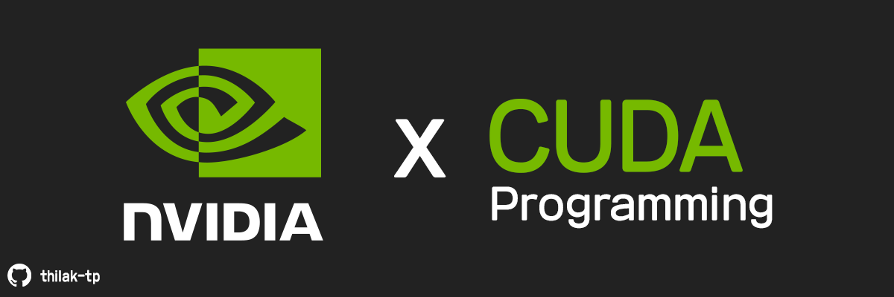
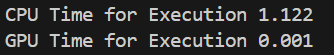
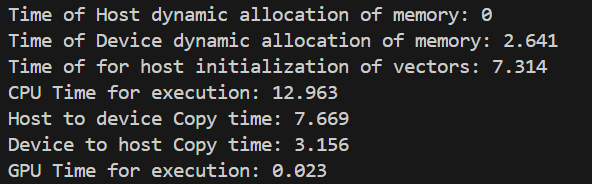

# CUDA Programming Projects

This repository involves all the CUDA code that I write in C++ to learn CUDA GPU Programming

1. 1.basic_hello_world  - A simple hello world program

2. 2.number_addition    - A simple program that adds two numbers in the GPU and prints the output

3. 3.count_till_billion - A simple program to count till a billion using CPU and GPU and then compare their performance

4. 4.vector_addition    - A program to add two vectors of length n using CPU and GPU and then compare their performance

---------------------------------------------------------------------------------------------------------------------------
# System Specifications

    Processor : Intel Core i7 - 12650H (10 Cores/16 Thread)
    GPU       : Nvidia RTX 3070 Ti, Mobile (8GB GDDR6 VRAM/ 5888 CUDA Cores / 46 SMs)
    RAM       : 16GB DDR4
---------------------------------------------------------------------------------------------------------------------------

